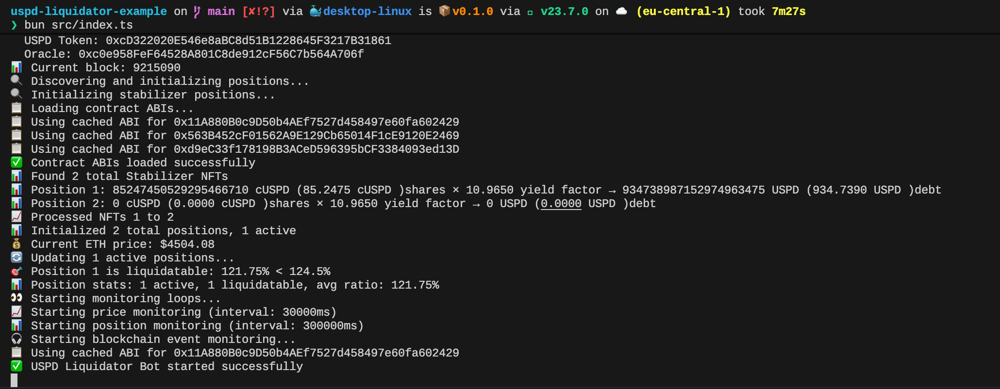

# 🚀 USPD Liquidation Bot - Earn Rewards by Securing the Protocol

**Turn market volatility into profit opportunities!** The USPD Liquidation Bot automatically monitors and liquidates undercollateralized positions in the [USPD protocol](https://uspd.io), earning you liquidation bonuses while helping maintain the stability of the US Permissionless Dollar.


*The bot automatically discovers positions, calculates profitability, and executes liquidations with detailed logging*

## 💰 Why Run a Liquidation Bot?

**Liquidation rewards are substantial and consistent:**
- **5-10% liquidation bonus** on every successful liquidation
- **Automatic profit calculation** ensures only profitable liquidations are executed
- **Real-time monitoring** catches opportunities as they emerge
- **Tiered liquidation thresholds** - earlier NFT holders get better liquidation opportunities
- **Market volatility = more opportunities** - ETH price drops create liquidation events

### Example Profit Scenario
- Position has $2,300 USPD debt
- ETH drops, position becomes undercollateralized
- You liquidate and earn 5% bonus = **$115 profit**
- Minus gas costs (~$45) = **~$70 net profit per liquidation**
- Multiple liquidations per day during volatile markets = **significant daily earnings**

## 🏗️ How USPD Liquidations Work

The USPD protocol maintains its $1 peg through overcollateralized positions backed by stETH. When ETH prices fall, some positions become undercollateralized and eligible for liquidation. Learn more about the [USPD economics and liquidation mechanics](https://uspd.io/docs/economics).

**Key concepts:**
- **Stabilizer Positions**: Individual collateralized debt positions backed by stETH
- **Liquidation Threshold**: Typically 110-125% collateralization ratio
- **Liquidation Bonus**: 5-10% reward for liquidators
- **Position Escrows**: Smart contracts holding the actual collateral

## 🚀 Quick Start

### Prerequisites
- Node.js 18+ and npm
- An Ethereum wallet with some ETH for gas fees
- USPD tokens for liquidations (can be acquired via DEX or minting)
- Etherscan API key (free)
- RPC endpoint (Alchemy, Infura, etc.)

### 1. Clone and Install
```bash
git clone <repository-url>
cd uspd-liquidation-bot
npm install
```

### 2. Configure Environment
Copy the example environment file and configure it:

```bash
cp .env.example .env
```

Edit `.env` with your configuration:

```bash
# RPC Configuration - Get from Alchemy, Infura, etc.
RPC_URL=https://eth-mainnet.g.alchemy.com/v2/your-api-key
WS_RPC_URL=wss://eth-mainnet.g.alchemy.com/v2/your-api-key

# Your wallet private key (keep this secure!)
PRIVATE_KEY=0x1234567890abcdef...

# Network (1 = Mainnet, 11155111 = Sepolia testnet)
CHAIN_ID=1

# Get free API key from etherscan.io
ETHERSCAN_API_KEY=your-etherscan-api-key

# Your Stabilizer NFT ID (0 for default, lower IDs get better thresholds)
LIQUIDATOR_NFT_ID=0

# Bot Configuration
MIN_PROFIT_THRESHOLD=0.01          # Minimum profit in ETH
PRICE_UPDATE_INTERVAL=30000        # Price check interval (30 seconds)
POSITION_UPDATE_INTERVAL=300000    # Position update interval (5 minutes)
```

### 3. Run the Bot
```bash
npm start
```

For verbose logging:
```bash
npm start -- --verbose
```

## ⚙️ Configuration Guide

### Environment Variables Explained

#### **RPC Configuration**
- `RPC_URL`: HTTP RPC endpoint for blockchain interactions
- `WS_RPC_URL`: WebSocket RPC endpoint for real-time event monitoring
- **Recommended providers**: Alchemy, Infura, QuickNode

#### **Wallet Configuration**
- `PRIVATE_KEY`: Your wallet's private key (must start with 0x)
- **Security**: Never commit this to version control, use a dedicated liquidation wallet

#### **Network Configuration**
- `CHAIN_ID`: 
  - `1` = Ethereum Mainnet
  - `11155111` = Sepolia Testnet (for testing)

#### **API Configuration**
- `ETHERSCAN_API_KEY`: Free API key from etherscan.io for fetching contract ABIs
- **Rate limits**: Free tier allows 5 calls/second, 100,000 calls/day

#### **Liquidator Configuration**
- `LIQUIDATOR_NFT_ID`: Your Stabilizer NFT ID
  - `0` = Default (110% liquidation threshold)
  - Lower IDs get better thresholds (e.g., ID 1 = 124.5%, ID 10 = 120%)
  - **Advantage**: Earlier NFT holders can liquidate positions at higher ratios

#### **Bot Behavior**
- `MIN_PROFIT_THRESHOLD`: Minimum profit in ETH to execute liquidation
- `PRICE_UPDATE_INTERVAL`: How often to check ETH prices (milliseconds)
- `POSITION_UPDATE_INTERVAL`: How often to refresh position data (milliseconds)
- `VERBOSE_LOGGING`: Set to `true` for detailed logging

### Advanced Configuration
- `MAX_CONCURRENT_LIQUIDATIONS=3`: Limit simultaneous liquidations
- `MAX_GAS_PRICE=50`: Maximum gas price in gwei
- `LIQUIDATION_BONUS_PERCENT=5`: Expected liquidation bonus percentage

## 🔧 How It Works

### 1. **Position Discovery**
The bot automatically discovers all Stabilizer NFT positions by:
- Querying the StabilizerNFT contract for total supply
- Fetching position escrow addresses for each NFT
- Loading position data (collateral, debt, owner)

### 2. **Health Monitoring**
For each position, the bot continuously:
- Fetches current ETH/USD price from USPD oracle
- Calculates collateralization ratio using position escrow contracts
- Converts cUSPD shares to actual USPD debt using yield factors
- Determines liquidation eligibility based on thresholds

### 3. **Profit Calculation**
Before liquidating, the bot calculates expected profit:
- **Liquidation bonus**: 5% of debt value
- **Gas costs**: Estimated transaction fees
- **Net profit**: Bonus minus costs
- **Threshold check**: Only proceeds if profit exceeds minimum

### 4. **Liquidation Execution**
When a profitable opportunity is found:
- Acquires necessary USPD tokens
- Calls `StabilizerNFT.liquidatePosition()`
- Receives stETH collateral plus bonus
- Logs transaction details and profit

## 📊 Monitoring and Logging

### Real-time Updates
```
🚀 Starting USPD Liquidator Bot...
📡 Fetching USPD contract deployments...
📊 Found 1247 total Stabilizer NFTs
📊 Initialized 1247 total positions, 892 active
💰 Current ETH price: $4503.27
📊 Position stats: 892 active, 3 liquidatable, avg ratio: 156.23%
🎯 Found 3 liquidatable positions
```

### Liquidation Attempts
```
🎯 Attempting to liquidate position 1
💰 ETH Price: $4503.27
🏦 Collateral: 0.640176 ETH ($2882.89)
💸 Debt: 2355191686191929973743 USPD (2355.1917 USPD)
🎁 Liquidation bonus (5%): $117.76
⛽ Estimated gas cost: 0.01 ETH ($45.03)
📊 Net profit: $72.73
💎 Net profit in ETH: 0.01615 ETH
✅ Successfully liquidated position 1
💰 Profit: 16150000000000000 ETH (0.0162 ETH)
```

### Verbose Mode
Enable with `--verbose` flag for detailed position information:
```
📋 Active Position Details:
  NFT #1: 🟢 HEALTHY | Ratio: 156.23% | Collateral: 1500000000000000000 ETH (1.5000 ETH) | Debt: 3000000000000000000000 USPD (3000.0000 USPD)
  NFT #2: 🔴 LIQUIDATABLE | Ratio: 108.45% | Collateral: 650000000000000000 ETH (0.6500 ETH) | Debt: 2400000000000000000000 USPD (2400.0000 USPD)
```

## 🛡️ Security Best Practices

### Wallet Security
- **Use a dedicated wallet** for liquidation activities
- **Keep minimal ETH balance** for gas fees only
- **Never share your private key** or commit it to version control
- **Consider using a hardware wallet** for key management

### Operational Security
- **Monitor bot activity** regularly
- **Set reasonable profit thresholds** to avoid unprofitable liquidations
- **Keep USPD balance** for liquidation opportunities
- **Update dependencies** regularly for security patches

### Risk Management
- **Start with testnet** (Sepolia) to familiarize yourself
- **Begin with conservative settings** (higher profit thresholds)
- **Monitor gas prices** during high network congestion
- **Have emergency stop procedures** ready

## 🔍 Troubleshooting

### Common Issues

**"Insufficient USPD balance"**
- Acquire USPD tokens from a DEX (Uniswap, etc.)
- Or mint USPD through the protocol if you have stETH

**"Liquidation profit too low"**
- Lower your `MIN_PROFIT_THRESHOLD`
- Wait for more volatile market conditions
- Check if your `LIQUIDATOR_NFT_ID` gives you better thresholds

**"Failed to fetch deployments"**
- Check your internet connection
- Verify RPC endpoints are working
- Ensure Etherscan API key is valid

**"Contract ABI not found"**
- Verify contract addresses are correct
- Check if contracts are verified on Etherscan
- Clear ABI cache: `rm -rf abi-cache/`

### Debug Mode
Run with additional logging:
```bash
DEBUG=* npm start
```

### Getting Help
- Check the [USPD documentation](https://uspd.io/docs/economics)
- Review contract addresses at [USPD contracts page](https://uspd.io/docs/uspd/addresses)
- Join the community Discord for support

## 📈 Optimization Tips

### Maximize Profits
1. **Get a low Stabilizer NFT ID** for better liquidation thresholds
2. **Monitor during volatile periods** (market crashes, major news)
3. **Optimize gas settings** for faster execution
4. **Keep USPD balance ready** to avoid acquisition delays
5. **Run multiple instances** on different networks if available

### Performance Tuning
- **Reduce update intervals** during high volatility
- **Increase concurrent liquidations** if you have sufficient capital
- **Use faster RPC endpoints** for competitive advantage
- **Monitor mempool** for gas price optimization

## 🤝 Contributing

We welcome contributions! Please:
1. Fork the repository
2. Create a feature branch
3. Add tests for new functionality
4. Submit a pull request

## 📄 License

This project is licensed under the MIT License - see the LICENSE file for details.

## ⚠️ Disclaimer

This software is provided "as is" without warranty. Liquidation bot operation involves financial risk. Users are responsible for:
- Understanding the USPD protocol mechanics
- Managing their own private keys and funds
- Complying with applicable laws and regulations
- Monitoring bot performance and profitability

**Always test on testnet first and start with small amounts.**

---

**Ready to start earning liquidation rewards? Follow the setup guide above and join the USPD ecosystem!**

For more information about USPD, visit [uspd.io](https://uspd.io) and read the [economics documentation](https://uspd.io/docs/economics).
